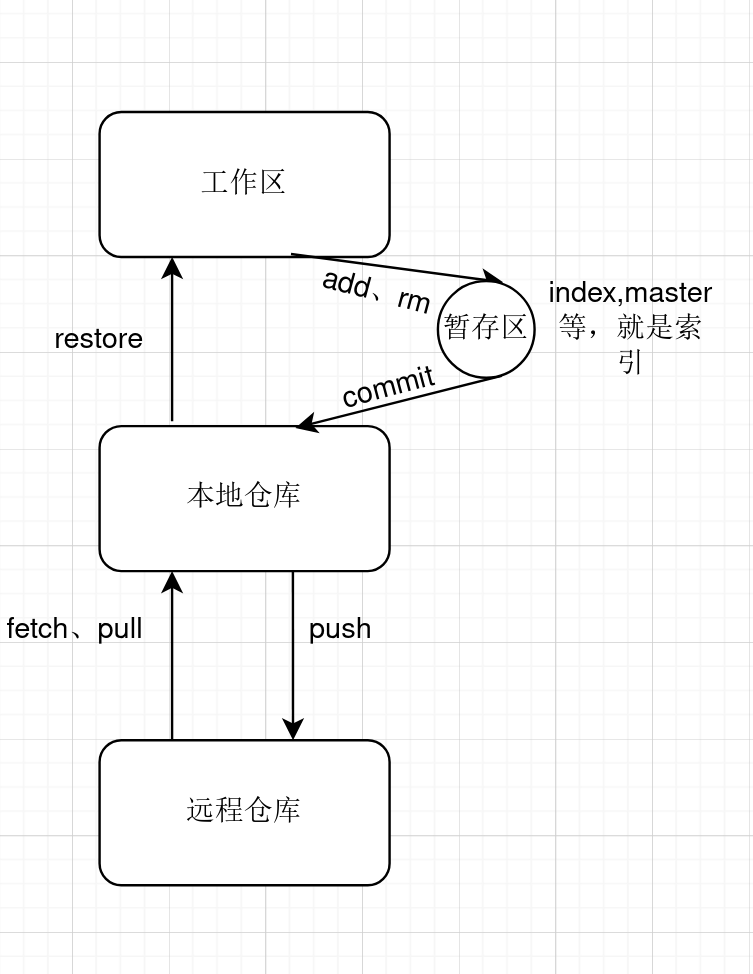

git是一个简单的版本控制器，就是字面意思，就是你把自己的文件之类的东西更新一下，还能保存回档，因为一个电脑的同一个目录是不允许有相同名称的文件存在的，必须要不同，否则就会触发警告，这个应该很明了。  
  
当然，如果只有回档这一个功能，那肯定不值得这么来学习的，也有很多可以代替它的存在，像SVN,只不过它必须要联网运行，它没有本地仓库，而git不需要，有本地仓库，且高效。svn就好像一个本地的git,只不过是扩大版的。同时，git也有了庞大的群体，看现在的平台github就是了，它也是一个超大型的git仓库，我们可以从它这拉取项目，也可以推出项目。这个功能是非常有用的，我们可以从这学习别人的项目和分享自己的项目，这是一件很有趣的事情，即提升自己也造福他人。  

好了，这是每个开发者都应该掌握的知识，不要认为自己平时用不上它，它在日常生活上非常有用。像我在去在平台上写代码，然后我把代码直接提交到自己的git仓库上，在我执行了这个操作的时候，就像当于有了一个副本，我可以随意去更改源文件了，而不需要去重新去写一遍这个代码。而且，它还能让你在两个或多个方向同时进行，就是创建另一个分支，走另一个方向，然后还能根据自己的要求来合并它们，这是很有用的功能。  

接下来我来给出基本的操作，git不需要太去深究，因为太多了，平时我们不需要这么多命令，其他的命令都是需要的时候再去搜索，这很简单的，不要想的太难了，最基本的命令10个手指头就能用了，而我们也够用了。

  

有条件的可以去读一下git官网，他们写的很详细，需要一点英语基础。

这里我给一下简单的命令：  
初始化工作区：  
clone       实现从远程仓库（像github）上拉去项目  
init        初始化自己的git仓库  
工作区：  
add         添加内容到暂存区
restore     把暂存区的内容重新放回工作区  
rm          从工作区删除  
解释历史和状态：  
diff        查看变化，从两次提交中  
log         查看日志  
status      查看工作区的状态  
之后的更新：  
branch      查看当前的分支  
commit      记录变化到仓库  
switch      重新设置主分支  
merge       合并两个或多个分支  
合作：  
fetch       从其他远程仓库下载项目  
pull        和fetch差不多都是，拉去项目  
push        把项目从本地推送到远程仓库
